#  LexiUp

LexiUp is a modern Android vocabulary learning application designed to help users systematically expand their English vocabulary using **active recall**, **spaced repetition**, and structured learning blocks.

The app is based on the **Oxford 5000 word list** and provides an offline-first learning experience with quizzes, progress tracking, and dictionary integration.

---

## 🚀 Features

- 📚 Learn vocabulary from Oxford 5000 word list
- 🧠 Active recall-based quiz system
- 🔁 Spaced repetition learning system
- 📦 Word blocks (minimum 10 words per block)
- 📊 Learning progress tracking (CEFR levels)
- 🔍 Dictionary integration (definitions, examples, phonetics)
- 🎧 Audio pronunciation support via API
- 📴 Hybrid Offline-First: Oxford 5000 word list is available immediately; detailed descriptions are fetched on-demand and cached for permanent offline use.
- 🏆 Overall and CERF categories statistics
- 🎯 Daily learning limits and review scheduling
- 🧾 Onboarding flow for new users
- ⚡ Splash Screen API support

---

## 📱 Screenshots

### Onboarding
| 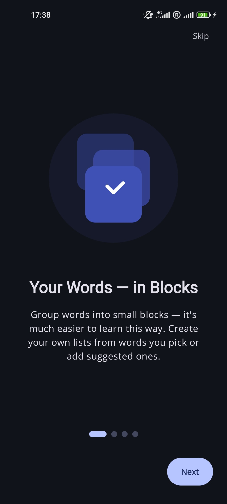 | 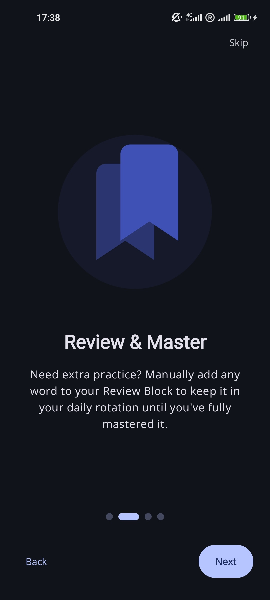 | 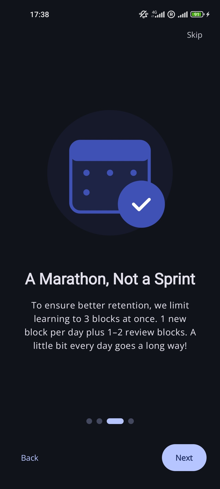 | 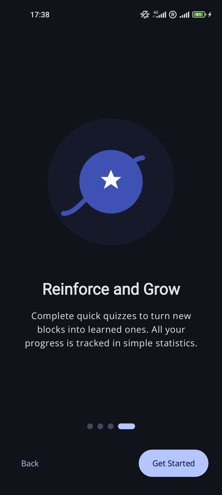 |
|:-------------------------------------------------:|:-------------------------------------------------:|:-------------------------------------------------:|:-------------------------------------------------:|

### Learning, Creating Blocks & Vocabulary
| 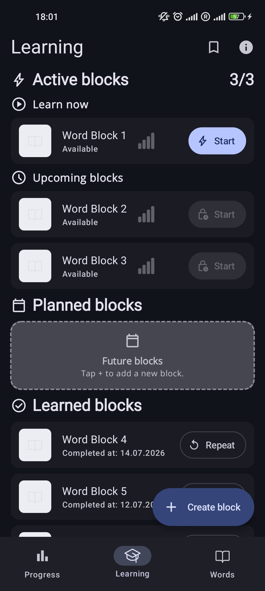 | 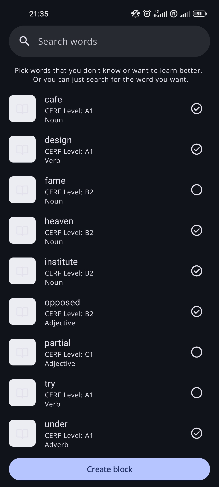 | 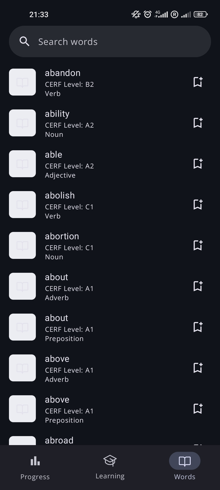 | 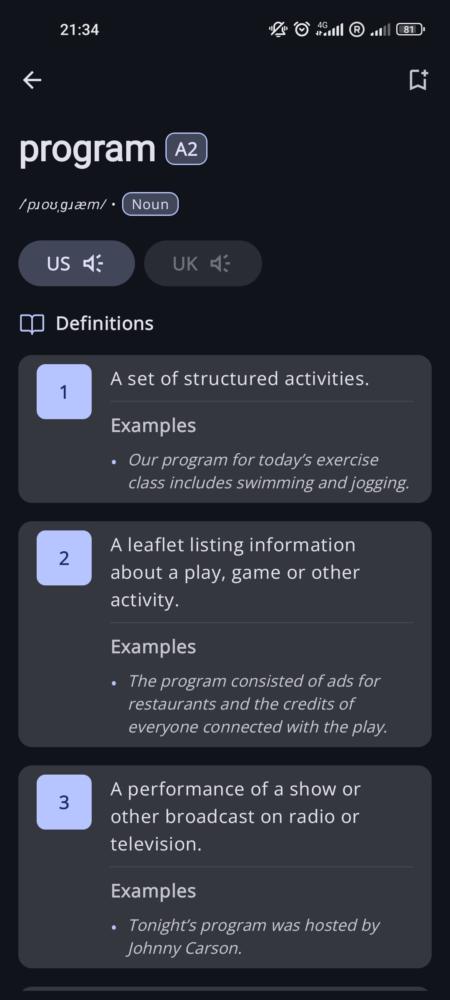 |
|:-----------------------------------------------:|:-----------------------------------------------------:|:-------------------------------------------------:|:---------------------------------------------------:|

### Quiz & Review
| 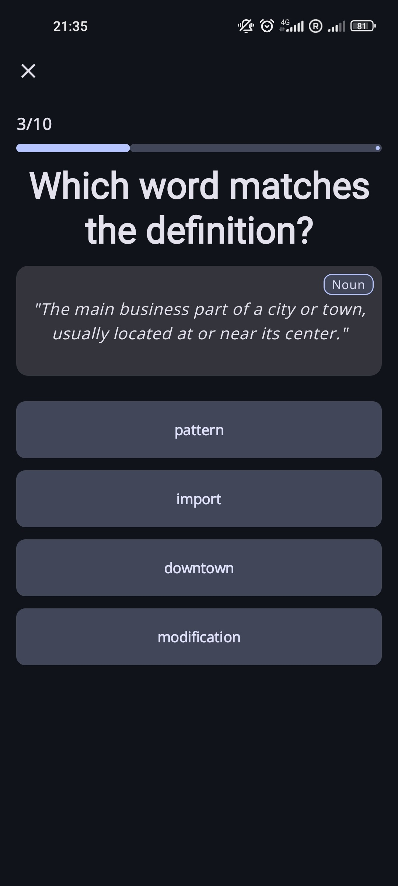 | 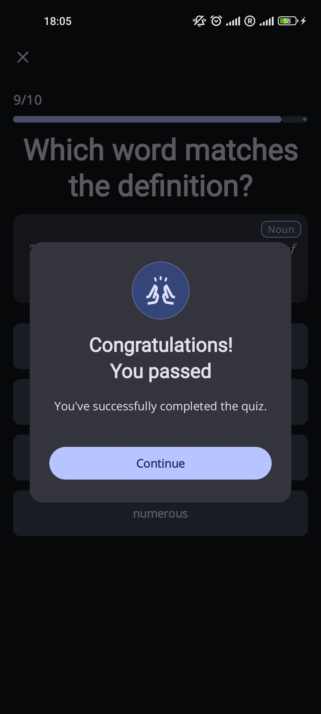 | 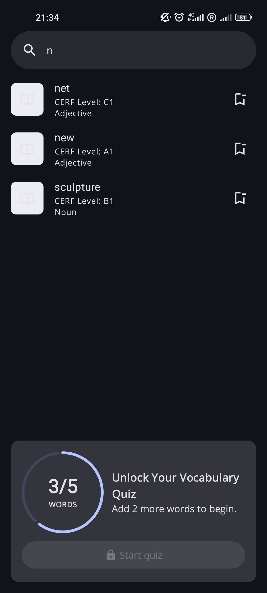 |
|:--------------------------------------------:|:------------------------------------------------------:|:---------------------------------------------------:|

### Statistics
| 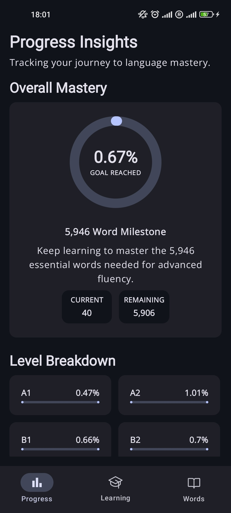 |
|:---------------------------------------------:|

### Error Handling & Limits
| 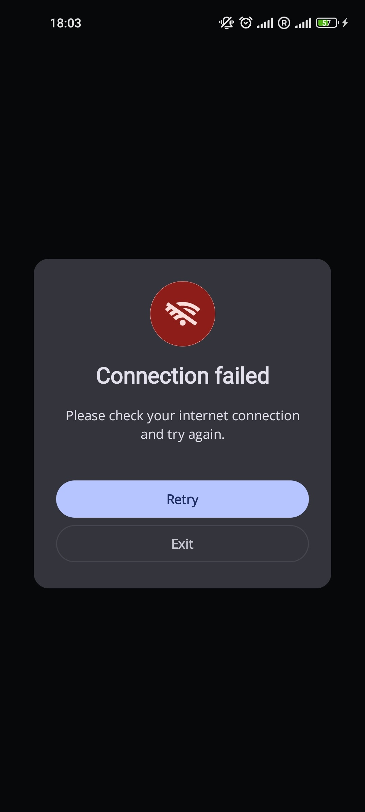 | 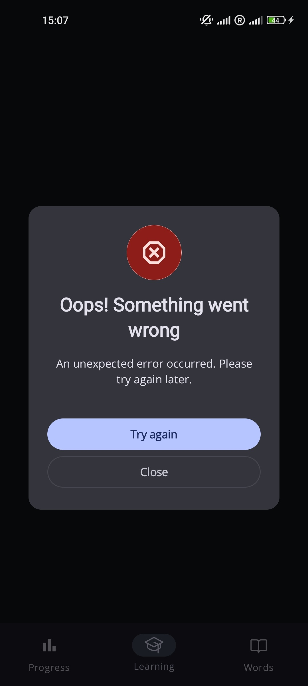 | 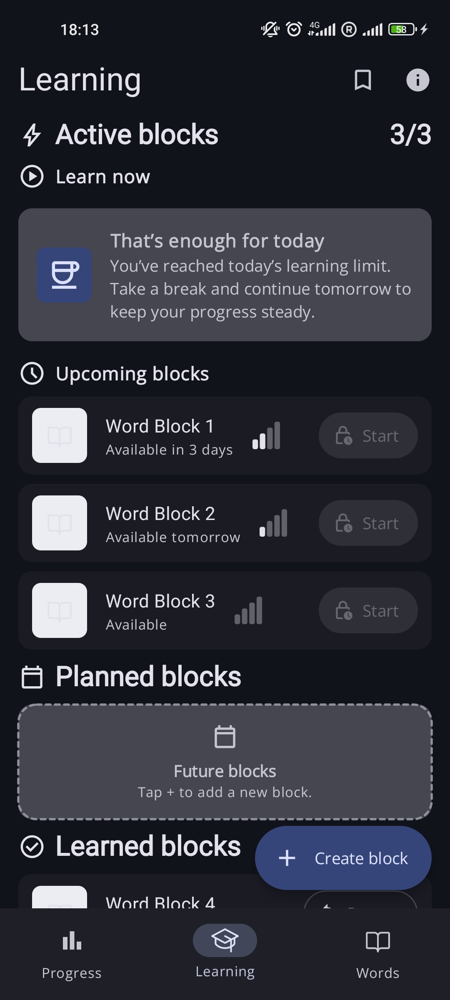 | 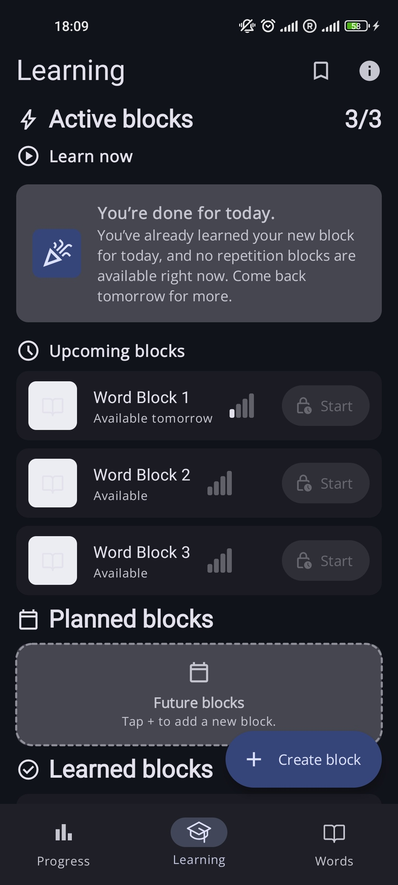 |
|:-------------------------------------------------------------:|:----------------------------------------------------------:|:-----------------------------------------------------------:|:----------------------------------------------------------------:|

---

## 🧠 Architecture Overview

LexiUp is built on **Clean Architecture** principles with a **feature-first** modular structure, ensuring high maintainability, testability, and scalability.

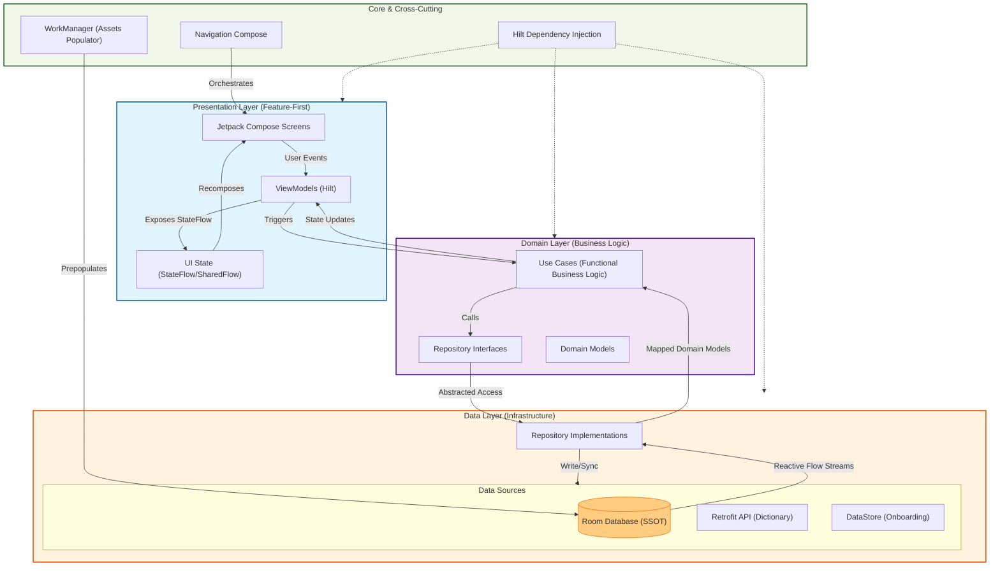

### 🏗 Architecture Principles

- **Feature-first modular structure**: Code is organized by feature (Words, Blocks, Quiz, Stats) rather than by layer type.
- **Strict Layering**: Domain layer has zero dependencies on other layers; Data layer depends on Domain.
- **Unidirectional Data Flow (UDF)**: State flows down, events flow up.
- **Hybrid Offline-First**: Room Database acts as the **Single Source of Truth (SSOT)**. Basic word data is pre-populated by deserializing a local JSON asset (`words5k.json`) via WorkManager. Detailed metadata (definitions, examples, phonetics) is fetched from the API upon first view and persisted in Room for offline access.
- **Efficient Room Projections**: Database queries are optimized using projections to fetch only the data required by the UI models.
- **Reactive Programming**: Full utilization of Kotlin Coroutines and Flow for asynchronous data streams.
- **Dependency Injection**: Hilt provides compile-time safe DI across all layers.

---

## 🧩 Tech Stack

### UI
- Kotlin
- Jetpack Compose
- Material 3
- Navigation Compose (Type-safe)
- Splash Screen API
- Google Fonts & Icons

### Architecture
- MVVM
- Clean Architecture
- UDF (Unidirectional Data Flow)
- Feature-first modularization

### Dependency Injection
- Hilt (Dagger)

### Async & Reactive
- Kotlin Coroutines
- Flow
- StateFlow
- SharedFlow

### Persistence
- Room Database (with Projections & Relations)
- DataStore (Preferences & Onboarding state)

### Networking
- Retrofit
- OkHttp
- Moshi
- Kotlin Serialization

### Tooling & Compilation
- KSP (Kotlin Symbol Processing)
- WorkManager (Background processing)
- JUnit 4
- Target SDK 36 support

---

## 🕸 Data & Networking

### Local Data Pre-population

To ensure the app is usable immediately after installation, the core Oxford 5000 word list is stored locally:
- **Asset Source**: `assets/words5k.json` contains the primary list of words, their CEFR levels, and parts of speech.
- **Moshi Deserialization**: During the first launch, **Moshi** deserializes this JSON file into Kotlin data objects.
- **WorkManager**: A background worker (`PopulateDataWorker`) handles the migration of these objects into the Room database, ensuring a smooth, non-blocking UI experience during the initial setup.

### External API Implementation

For rich dictionary content, LexiUp uses the **Free Dictionary API**:
- **Retrofit**: Used for defining and managing HTTP requests to the dictionary service.
- **Moshi**: Converts API JSON responses into database-ready entities.
- **On-Demand Caching**: The Repository layer implements a "fetch-on-view" strategy. When a user opens a word's details, the app checks the Room database; if data is missing, it triggers a Retrofit call, parses the response, and saves it to Room.
- **Resilience**: Implements retry logic with exponential backoff for transient network errors and handles rate limits.

API source:
https://dictionaryapi.dev/

The API is used for:
- Fetching word definitions and meanings
- Retrieving example sentences
- Loading phonetic information
- Providing pronunciation audio files (MP3)

### API Availability Notice

Since LexiUp relies on a third-party free API, some features may be temporarily unavailable if the external service experiences downtime or rate limitations.

In case of API unavailability:
- **Offline SSOT**: Previously cached data remains available offline.
- **Graceful Degradation**: The application handles failed requests using placeholder data or error states, allowing the core quiz functionality to remain usable.

---

## 🗄 Data Flow Example

**Word List Flow:**

1. UI subscribes to `StateFlow`
2. ViewModel triggers Use Case
3. Use Case calls Repository
4. Repository fetches data from Room DAO
5. Room emits `Flow<List<Words>>`
6. Data is mapped to UI models
7. UI recomposes automatically

---

## 🧪 Testing Strategy

The project focuses on unit testing of core business logic:

- Quiz engine logic
- Progress calculation
- Spaced repetition scheduling
- Block activation / deactivation logic

The architecture allows testing domain logic in isolation without Android dependencies.

---

## 📊 Project Scale

- ~200+ project files
- ~8,800+ lines of Kotlin code
- 27+ Use Cases
- 10 ViewModels
- 4 Repositories
- 7 Room Entities
- 4 Feature modules:
  - Words
  - Blocks
  - Quiz
  - Stats

---

## 🧠 Key Engineering Highlights

- Hybrid Offline-First Architecture: Base vocabulary is pre-populated from local assets; detailed metadata is cached on-demand using Room as the single source of truth.
- Clean separation between Domain, Data, and Presentation layers
- Lifecycle-aware reactive UI with StateFlow & `collectAsStateWithLifecycle`
- Efficient Room projections & relational mapping for optimized queries
- Type-safe navigation implementation using Kotlin Serialization
- Background database pre-population from JSON assets using WorkManager and Moshi.
- Modern Kotlin Symbol Processing (KSP) for dependency generation
- Strong use-case-driven business logic design
- Interface-based repository abstraction for testability

---

**LexiUp is a non-commercial educational pet project created solely to demonstrate technical 
(design/development) skills and is not affiliated with any existing services or companies of the same name.**